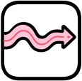
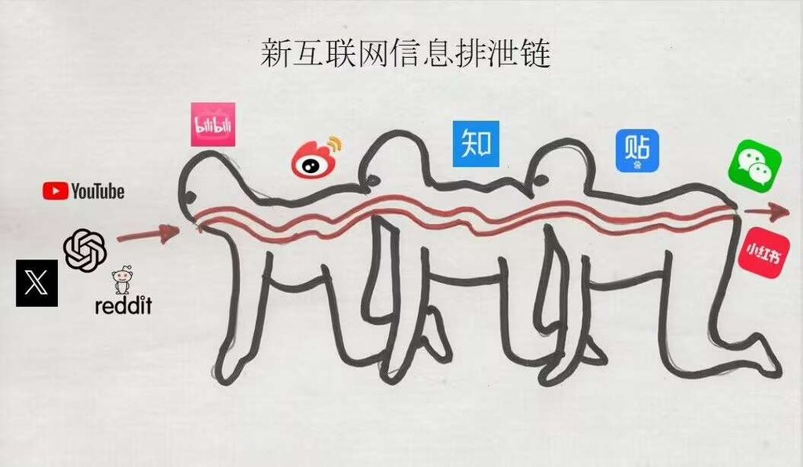

  

<h1 align="center">Gutchain(信息排泄链)</h1>

  一个 Chrome 扩展：海外内容，一键传送到中文互联网。

---

## What It Does?

刷 X 看到好内容想搬到小红书？点一下 Gutchain 按钮——它会自动截取推文图片、提取正文，然后帮你填入小红书创作页面。你只需要点发布。

  

## Why I Made It?

  

